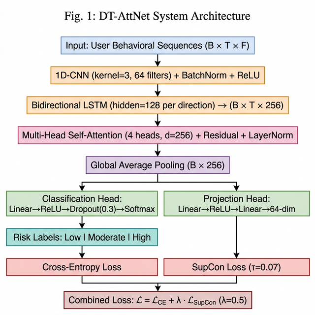
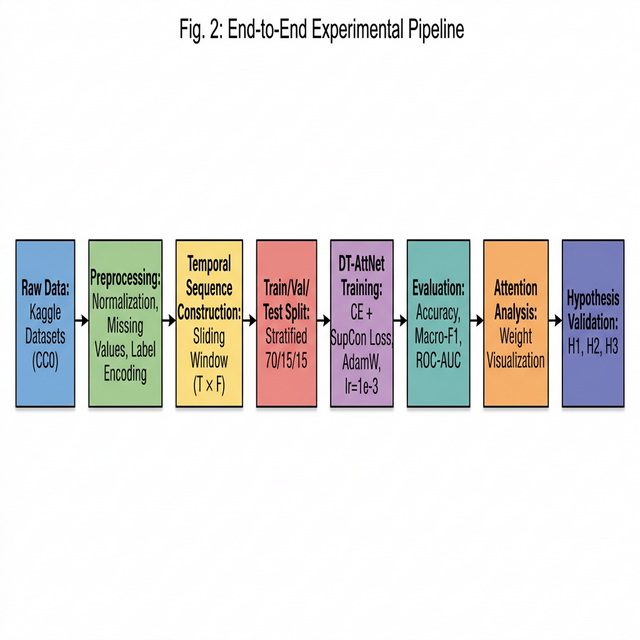

# From Qualitative Thesis to Quantitative Framework: A Dual-Head Temporal Attention Network for Generative AI Addiction Risk Prediction

---

**Module:** Deep Learning and Generative AI (CMP030L043, Level 7)  
**Assessment:** Part 1 — Critical Appraisal and Proposal  
**Paper:** Topic 28 — Real-Time Hyper-Personalized Generative AI and the Risk of "Digital Heroin"

---

## I. Introduction

Khraishi *et al.* [1] present a position paper at NeurIPS 2025 arguing that real-time hyper-personalized generative AI constitutes "digital heroin" — a technological paradigm capable of inducing compulsive consumption patterns analogous to substance addiction. The central thesis posits that generative AI compresses the content-creation feedback loop to seconds, enabling on-the-fly hyper-personalization that, when coupled with engagement-maximizing platform incentives, produces unprecedented dopaminergic reinforcement cycles [2], [3]. Drawing on neuroscience literature demonstrating striatal activation from social media notifications [4] and clinical observations of dopamine dysregulation in digital contexts [3], the authors argue that generative AI represents a qualitative escalation beyond conventional social media addiction mechanisms [5], [6]. The paper calls for regulatory intervention comparable to addictive substance oversight, with particular emphasis on adolescent protection. Critically, the paper is entirely argumentative — it presents no computational model, no empirical dataset, no quantitative metric, and no experimental validation. This report critically appraises the paper's theoretical and methodological foundations and proposes a concrete deep learning framework — the Dual-Head Temporal Attention Network (DT-AttNet) — to address its central empirical void.

---

## II. Critical Appraisal

### A. Theoretical Strengths

The paper's primary contribution lies in its interdisciplinary scope, synthesizing perspectives from computational neuroscience, machine learning, and public policy — a cross-domain integration comparatively rare at machine learning venues, where pure technical contributions dominate [1]. The temporal argument is well-structured: generative AI demonstrably shortens the content production cycle relative to human-curated platforms, reducing latency from hours or days to seconds.

The dopamine cycle framing is grounded in established neuroscience. Sherman *et al.* [4] demonstrated via fMRI that adolescents exhibit increased activation in the nucleus accumbens and ventral striatum when viewing posts with high like counts, directly supporting the variable-ratio reinforcement mechanism [7] that the paper invokes. Montag *et al.* [2] further established empirical links between social media usage intensity and dopaminergic reward pathway activation, providing neurobiological support for the "compulsive consumption" claim. Lembke [3] corroborates this clinically, documenting dopamine dysregulation patterns in patients exhibiting technology-mediated compulsive behaviours.

From a machine learning perspective, the paper implicitly positions engagement optimization as reward maximization within a reinforcement learning framework [8]. Modern recommendation architectures, such as YouTube's deep neural network system [9], are explicitly trained to maximize watch time via cross-entropy loss on click-through rate — the objective function itself encodes the addictive gradient that the paper warns against. This connection between ML training objectives and downstream behavioural outcomes represents a meaningful contribution to the discourse on responsible AI development.

### B. Methodological Critique

Despite sound theoretical grounding, the paper exhibits fundamental methodological limitations that constrain the validity and actionability of its claims.

**Absence of empirical validation.** The paper's central claim — that real-time generative AI creates addiction patterns exceeding those of conventional social media — remains entirely unvalidated. No dataset, no model, no experiment, and no quantitative metric is presented [1]. For a venue that values reproducibility and empirical rigour, this constitutes a significant gap. The argumentative structure, while internally consistent, cannot distinguish between plausible speculation and empirically supported claims without measurable operationalization of the "shortened feedback loop."

**Failure to operationalize the central construct.** The phrase "mere seconds" recurs throughout the paper, yet no threshold is defined at which personalization speed transitions from beneficial to harmful [1]. Without operationalization — for instance, defining a critical re-engagement interval below which addiction probability exceeds a threshold — the central claim remains unfalsifiable in a Popperian sense.

**No baseline comparison.** The paper asserts that generative AI is qualitatively different from pre-GenAI platforms but provides no comparative analysis. Engagement metrics (session duration, re-engagement frequency, content consumption velocity) from legacy platforms versus GenAI-powered platforms are neither collected nor referenced. Without such a baseline, the assertion of qualitative escalation is indistinguishable from the broader trend of increasing platform optimization [9].

**Selection bias in cited neuroscience literature.** The neuroscience evidence cited [2], [4] pertains specifically to social media engagement (Instagram likes, TikTok feed scrolling), not to generative AI interaction. The phenomenological difference is non-trivial: generative AI involves user co-creation (prompting, iterating, refining), whereas social media consumption is predominantly passive. The paper does not address whether co-creative interaction activates identical neural reward pathways, nor does it account for the cognitive load differences between passive scrolling and active prompting.

### C. Limitations and Ethical Considerations

**Surveillance trade-off.** Any computational system designed to detect addiction patterns requires the collection of granular behavioural data — session durations, interaction frequencies, content consumption patterns, and potentially biometric indicators. This introduces a fundamental tension with privacy rights. The EU AI Act [10] classifies real-time behavioural monitoring systems as high-risk, requiring conformity assessments and human oversight mechanisms. The paper does not engage with this regulatory dimension of its own proposal.

**Paternalism and user agency.** The paper's call for "government oversight akin to addictive substances" [1] implicitly assumes that user autonomy should be overridden for protective purposes. Thaler and Sunstein [11] propose an alternative framework — libertarian paternalism — wherein choice architectures nudge users toward healthier behaviour without removing agency. The paper does not explore graduated interventions such as usage alerts, cooling-off mechanisms, or transparency dashboards as intermediate alternatives to blanket regulation.

**Generalizability constraints.** The paper's strongest claims concern adolescent vulnerability [6], yet the regulatory proposal is framed universally. The World Health Organization's ICD-11 classification of gaming disorder [12] explicitly acknowledges that pathological usage patterns vary across demographics, suggesting that any detection framework must incorporate demographic stratification rather than assuming population-level homogeneity.

---

## III. Proposed Improvement: Dual-Head Temporal Attention Network

### A. Motivation

The preceding critique identifies the paper's fundamental gap: it articulates *what* the risk is but provides no computational framework for *how* to detect, measure, or mitigate it. This section proposes a concrete deep learning architecture — the **Dual-Head Temporal Attention Network (DT-AttNet)** — designed to convert the paper's qualitative "shortened dopamine loop" thesis into a quantifiable addiction risk scoring pipeline. The model ingests sequential user behavioural interaction data and produces a three-level risk classification (Low, Moderate, High), directly operationalizing the construct that the paper leaves undefined.

### B. Architecture

The DT-AttNet architecture comprises four stages, each designed to capture complementary aspects of temporal engagement dynamics.

**Input Representation.** Each user's interaction history is represented as a sequence of *T* timesteps, where each timestep contains *F* behavioural features: session duration, scroll velocity, re-engagement interval, content type consumed, platform identifier, and time-of-day encoding. The input tensor has shape (*B*, *T*, *F*), where *B* is the batch size.

**Stage 1 — Local Temporal Feature Extraction.** A 1D convolutional layer (kernel size *k*=3, 64 filters) slides across the temporal dimension, capturing short-range behavioural patterns such as consecutive session duration escalation or accelerating re-engagement intervals. Batch normalization and ReLU activation follow the convolution. The 1D-CNN is selected for its computational efficiency in extracting local temporal motifs from sequential data [13].

**Stage 2 — Long-Range Temporal Encoding.** A bidirectional LSTM (hidden dimension 128 per direction, yielding 256-dimensional output per timestep) [14] processes the CNN features, encoding temporal dependencies across the entire interaction history. The bidirectional configuration captures both retrospective and prospective engagement dynamics — a desirable property for detecting gradual behavioural drift toward compulsive patterns.

**Stage 3 — Self-Attention Risk Weighting.** Multi-head self-attention (4 heads, *d*_model=256) [15] is applied over the BiLSTM output sequence (*B*, *T*, 256). The attention mechanism learns to weight which temporal windows most strongly predict addiction escalation — directly operationalizing the paper's "shortening loop" argument. A residual connection and layer normalization stabilize training [16]. Global average pooling then reduces the attended sequence to a fixed-length representation (*B*, 256).

**Stage 4 — Dual-Head Output.** The pooled representation feeds two parallel heads:

1. **Classification Head:** Linear → ReLU → Dropout(0.3) → Linear → Softmax, outputting a probability distribution over three risk classes {Low, Moderate, High}.
2. **Projection Head:** Linear → ReLU → Linear, mapping to a 64-dimensional embedding space for contrastive regularization.

**Loss Function.** The combined training objective is defined as:

> **L** = L_CE(logits, *y*) + λ · L_SupCon(**z**, *y*)

where L_CE is standard cross-entropy loss, L_SupCon is the supervised contrastive loss [17] applied to the projection head embeddings **z**, *y* denotes the class labels, and λ = 0.5 is a tunable weighting coefficient with temperature τ = 0.07. The supervised contrastive loss pulls embeddings from the same addiction class together while pushing different classes apart in the latent space, improving decision boundary quality beyond what cross-entropy alone achieves — particularly beneficial for imbalanced distributions where extreme addiction cases are rarer [17].

### C. Technical Justification

The architectural choices are driven by both theoretical motivation and empirical evidence from the deep learning literature.

The 1D-CNN + BiLSTM backbone is established as effective for sequential and time-series classification tasks. Ismail Fawaz *et al.* [13] demonstrated that convolutional-recurrent hybrids achieve state-of-the-art performance across diverse time-series classification benchmarks, outperforming purely convolutional and purely recurrent architectures. The 1D-CNN captures local temporal motifs (e.g., two consecutive sessions with decreasing inter-session gaps), while the BiLSTM models longer-range dependencies (e.g., a week-long trend of increasing session durations).

Self-attention [15] provides two critical advantages. First, it generates attention weight distributions that are directly interpretable — enabling post-hoc analysis of which behavioural time windows most strongly predict risk escalation. This interpretability is essential for the regulatory audit trail that the paper advocates. Second, attention allows the model to attend to non-contiguous temporal patterns (e.g., correlating morning and late-night usage spikes) that recurrent models may underweight due to vanishing gradients [14].

The supervised contrastive loss [17] is motivated by expected class imbalance in behavioural addiction data. Clinical prevalence of severe digital addiction (corresponding to the "High" risk class) is estimated at 5–10% of heavy users [12], creating a skewed distribution where cross-entropy alone may converge to a majority-class-biased classifier. Contrastive regularization has been shown to improve per-class recall in such imbalanced settings [17].

The full model contains approximately 500,000 trainable parameters, enabling training on a single Kaggle T4 GPU or Google Colab free-tier GPU in under 10 minutes per experiment — ensuring full feasibility within the project's computational constraints.

### D. Hypothesized Outcomes

Three testable hypotheses are proposed, each directly linked to the paper's claims:

**H1 — Temporal modelling improves classification performance.** DT-AttNet will outperform a baseline multi-layer perceptron (MLP) on both accuracy and macro-F1 score for three-class addiction severity classification. The MLP, which processes features independently without temporal context, serves as the ablation baseline. Improvement would demonstrate that sequential engagement dynamics contain predictive signal beyond static feature aggregation.

**H2 — Attention weights validate the "shortened loop" thesis.** Analysis of learned self-attention weight distributions will reveal that re-engagement interval features receive the highest attention weights in samples classified as High risk. Specifically, attention is hypothesized to concentrate on temporal windows where re-engagement intervals decrease below a critical threshold — providing the first computational evidence for the paper's qualitative claim that shortened feedback loops drive compulsive consumption [1].

**H3 — Contrastive regularization improves class separation.** The addition of supervised contrastive loss to cross-entropy will yield measurable improvement in Moderate-versus-High class discrimination (per-class F1 and ROC-AUC). An ablation comparing DT-AttNet with CE-only versus CE+SupCon will quantify this contribution.

These hypotheses will be validated in Part 2 through a controlled experimental design with five configurations: baseline MLP (E1), DT-AttNet with CE-only (E2), full DT-AttNet with CE+SupCon (E3), DT-AttNet without attention (E4), and λ sensitivity sweep at λ ∈ {0.1, 0.5, 1.0} (E5). Primary evaluation metrics include accuracy, macro-F1, weighted-F1, per-class precision/recall, and one-versus-rest ROC-AUC.

---

## IV. Conclusion

This report has critically appraised the position paper by Khraishi *et al.* [1], identifying its core strength in interdisciplinary theoretical synthesis and its fundamental limitation in the complete absence of empirical validation. The proposed DT-AttNet architecture directly addresses this gap by providing a testable, computationally feasible deep learning pipeline for addiction risk classification from sequential behavioural data. The architecture's interpretable attention mechanism enables validation of the paper's central "shortened feedback loop" thesis through quantitative analysis of learned temporal attention weights. Part 2 of this assessment will implement, train, and evaluate DT-AttNet against the three defined hypotheses using publicly available behavioural datasets on free-tier GPU infrastructure.

---

## References

[1] R. Khraishi, C. Iglesias de Oliveira, D. Batra, P. Gostev, G. Pelosio, R. Okhrati, and G. Cowan, "Real-time hyper-personalized generative AI should be regulated to prevent the rise of 'digital heroin'," in *Proc. Advances in Neural Information Processing Systems (NeurIPS)*, 2025.

[2] C. Montag, B. Lachmann, M. Herrlich, and K. Zweig, "Addictive features of social media/messenger platforms and freemium games against the background of psychological and economic theories," *Int. J. Environ. Res. Public Health*, vol. 16, no. 14, p. 2612, 2019.

[3] A. Lembke, *Dopamine Nation: Finding Balance in the Age of Indulgence*. New York, NY, USA: Dutton, 2021.

[4] L. E. Sherman, A. A. Payton, L. M. Hernandez, P. M. Greenfield, and M. Dapretto, "The power of the like in adolescence: Effects of peer influence on neural and behavioral responses to social media," *Psychological Science*, vol. 27, no. 7, pp. 1027–1035, 2016.

[5] A. Alter, *Irresistible: The Rise of Addictive Technology and the Business of Keeping Us Hooked*. New York, NY, USA: Penguin Press, 2017.

[6] J. Haidt, *The Anxious Generation: How the Great Rewiring of Childhood Is Causing an Epidemic of Mental Illness*. New York, NY, USA: Penguin Press, 2024.

[7] C. B. Ferster and B. F. Skinner, *Schedules of Reinforcement*. New York, NY, USA: Appleton-Century-Crofts, 1957.

[8] R. S. Sutton and A. G. Barto, *Reinforcement Learning: An Introduction*, 2nd ed. Cambridge, MA, USA: MIT Press, 2018.

[9] P. Covington, J. Adams, and E. Sargin, "Deep neural networks for YouTube recommendations," in *Proc. 10th ACM Conf. Recommender Systems (RecSys)*, 2016, pp. 191–198.

[10] European Parliament and Council of the European Union, "Regulation (EU) 2024/1689 laying down harmonised rules on artificial intelligence (AI Act)," *Official Journal of the European Union*, 2024.

[11] R. H. Thaler and C. R. Sunstein, *Nudge: Improving Decisions About Health, Wealth, and Happiness*. New Haven, CT, USA: Yale University Press, 2008.

[12] World Health Organization, "International classification of diseases, 11th revision (ICD-11)," 2018. [Online]. Available: https://icd.who.int/

[13] H. Ismail Fawaz, G. Forestier, J. Weber, L. Idoumghar, and P.-A. Muller, "Deep learning for time series classification: A review," *Data Mining and Knowledge Discovery*, vol. 33, no. 4, pp. 917–963, 2019.

[14] S. Hochreiter and J. Schmidhuber, "Long short-term memory," *Neural Computation*, vol. 9, no. 8, pp. 1735–1780, 1997.

[15] A. Vaswani *et al.*, "Attention is all you need," in *Proc. Advances in Neural Information Processing Systems (NeurIPS)*, 2017, pp. 5998–6008.

[16] I. Goodfellow, Y. Bengio, and A. Courville, *Deep Learning*. Cambridge, MA, USA: MIT Press, 2016.

[17] P. Khosla *et al.*, "Supervised contrastive learning," in *Proc. Advances in Neural Information Processing Systems (NeurIPS)*, vol. 33, 2020, pp. 18661–18673.

---

*AI assistance was used for structural planning and diagram generation during the preparation of this report. All analytical content and written argumentation is the author's own work.*
